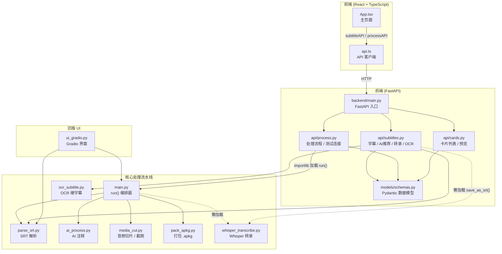

# 项目架构



## 模块依赖链

```
前端 App.tsx ──► api.ts ──HTTP──► FastAPI ──importlib──► main.run()
                                                              │
                                              ┌────────────────┼────────────────┐
                                              ▼                ▼                ▼
                                         parse_srt.py    ai_process.py    media_cut.py
                                         (解析字幕)       (AI 注释)        (音频+截图)
                                                                              │
                                                                              ▼
                                                                        pack_apkg.py
                                                                        (打包牌组)
```

## API 端点清单

| 端点 | 说明 |
|------|------|
| `POST /api/subtitles/upload` | 上传 SRT 字幕 |
| `POST /api/subtitles/extract-embedded-subs` | 提取内嵌软字幕 |
| `POST /api/subtitles/detect-visible-subs` | 检测硬字幕 |
| `POST /api/subtitles/ocr-extract` | OCR 识别硬字幕 |
| `POST /api/subtitles/transcribe` | Whisper 转录 |
| `POST /api/subtitles/ai-recommend` | AI 筛选推荐句子 |
| `POST /api/process/upload-and-process` | 上传视频+字幕，生成卡片 |
| `POST /api/process/test-connection` | 测试 AI API 连接 |
| `POST /api/process/list-models` | 获取 AI 模型列表 |
| `GET /api/cards/list` | 列出卡片 |
| `POST /api/cards/preview` | 预览卡片 HTML |

## 字幕生成方案链

```
用户点击「生成字幕」
        │
        ▼
  ┌─ 方案一：提取软字幕 (ffmpeg, <1s) ──► 成功 → 返回
  │
  ├─ 方案二：OCR 识别硬字幕 (PaddleOCR) ──► 成功 → 返回
  │
  └─ 方案三：Whisper 转录 (备选) ──► 弹出模型选择器
```
